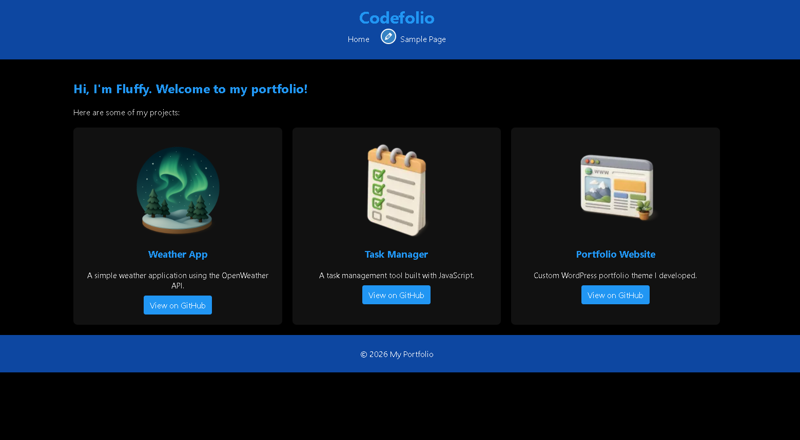

# My Portfolio Theme
A custom WordPress portfolio theme built with a **blue and black design**, responsive layout, and a dedicated **Projects section** to showcase GitHub repositories.
---

## ✨ Features
- 🎨 Blue and black styled layout for a modern, professional look
- 📱 Responsive design that adapts to desktop and mobile
- 🧭 Custom navigation menu for easy site navigation
- 📂 Projects custom post type to highlight GitHub repos and screenshots
- ⚡ Lightweight and fast — built with clean PHP, HTML, and CSS
- 🔧 Easy to extend with WordPress hooks and functions

---

## 📥 Installation
1. Download or clone this repository

